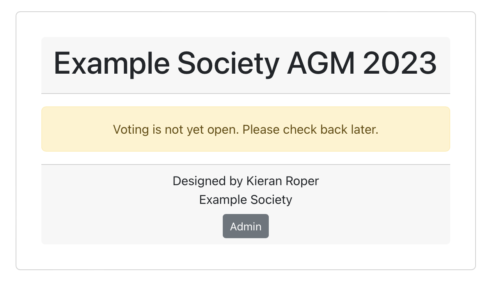
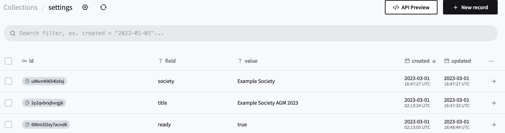
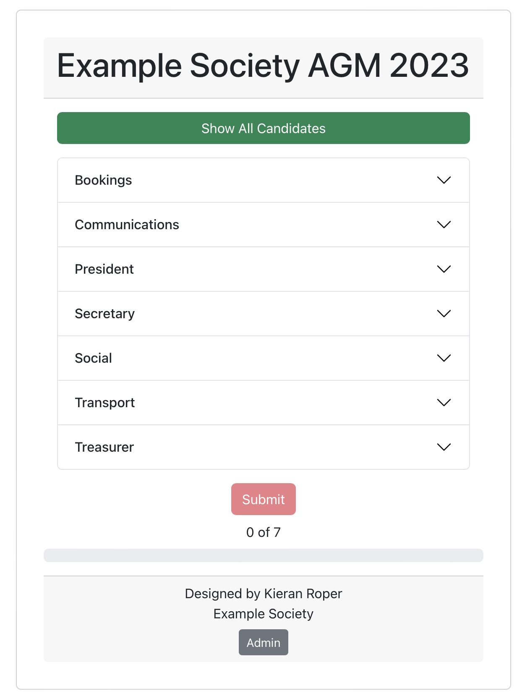
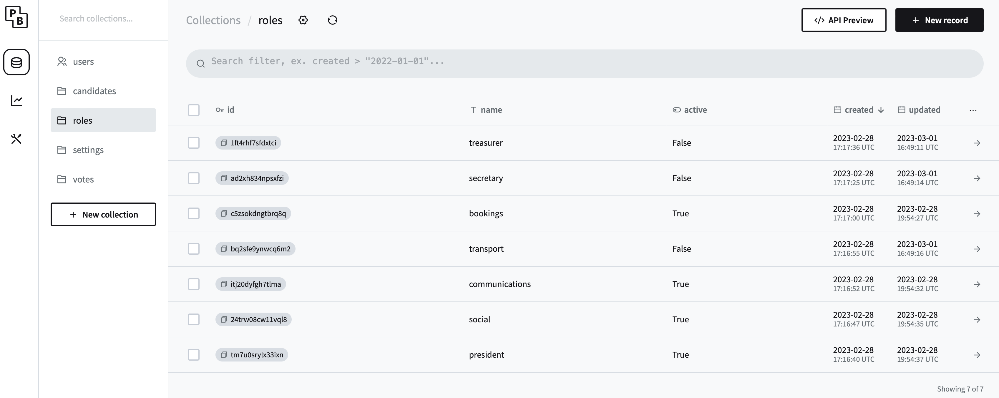
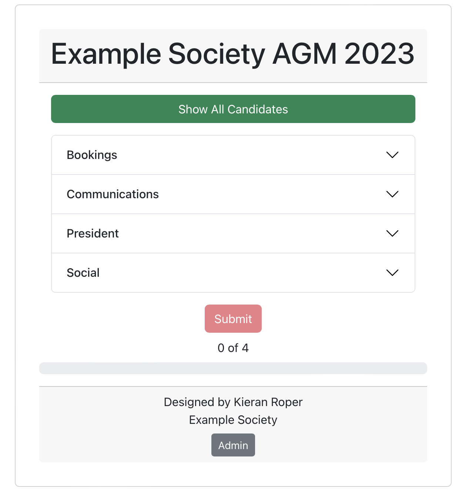
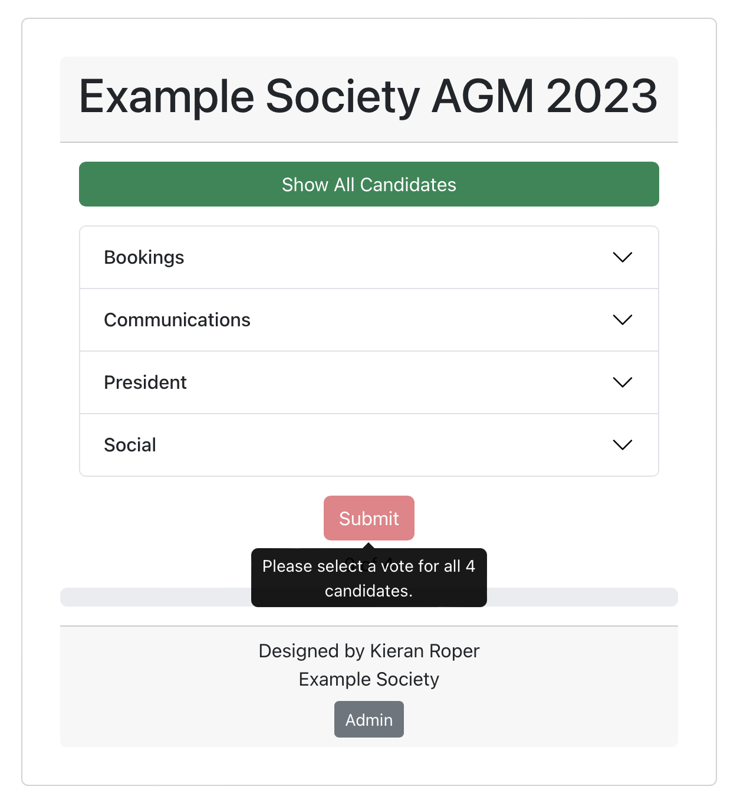
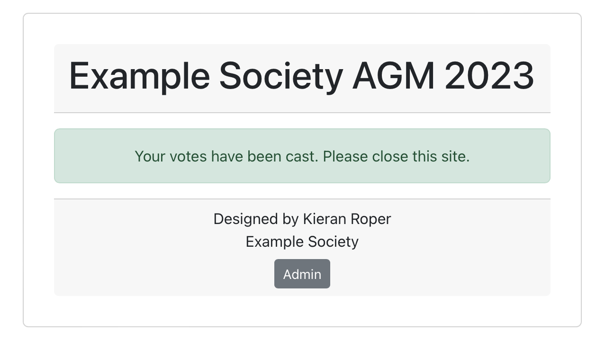
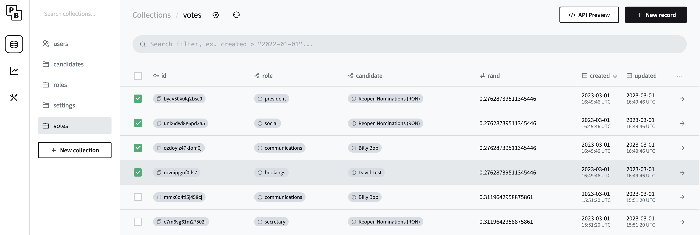

# Voting App

##  About

This is a side project using Svelte, Typescript, Vite, and Pocketbase to create a web-app capable of counting and storing votes.

Made by Kieran Roper.

## To-do

- [x] Basic Functionality
- [ ] Web admin interface
  - [ ] Alter candidates
  - [ ] Make ready
  - [ ] View votes
  - [ ] Alter candidates
- [ ] Anti-multiple vote verification
  - [ ] Anonymous sign-in using Microsoft Exchange to prevent multiple votes from same person
  - [ ] Authenticate member of University of Birmingham.
- [ ] AGM Location, time, room, etc. information

## Functionality

### Functionality Demonstration

<blockquote class="imgur-embed-pub" lang="en" data-id="a/I6Ogl3f" data-context="false" ></blockquote>

 
 Functionality images 

 

## Acknowledgements

- Pocketbase
- Fireship, for inspiration for this project.
  